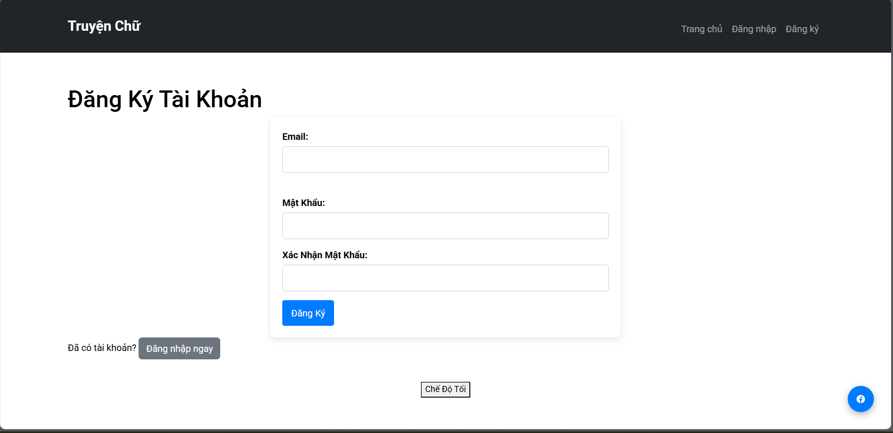
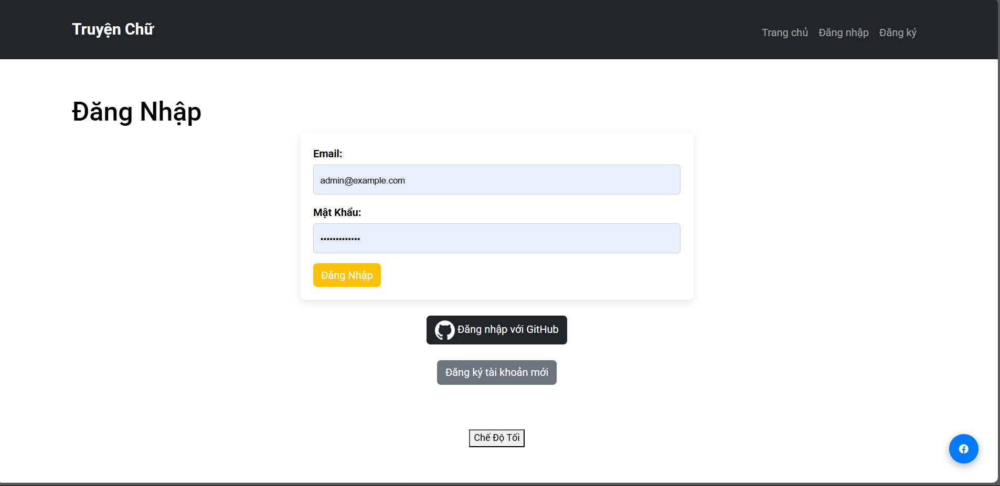
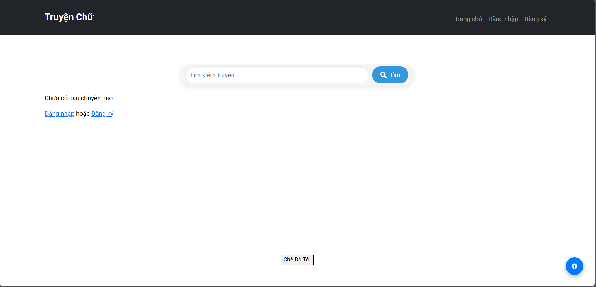
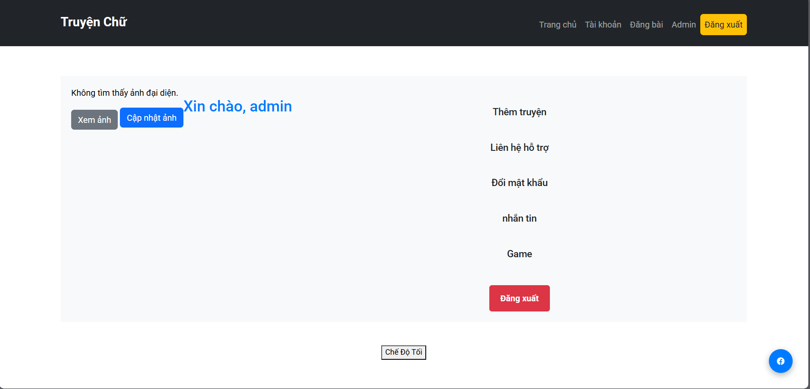
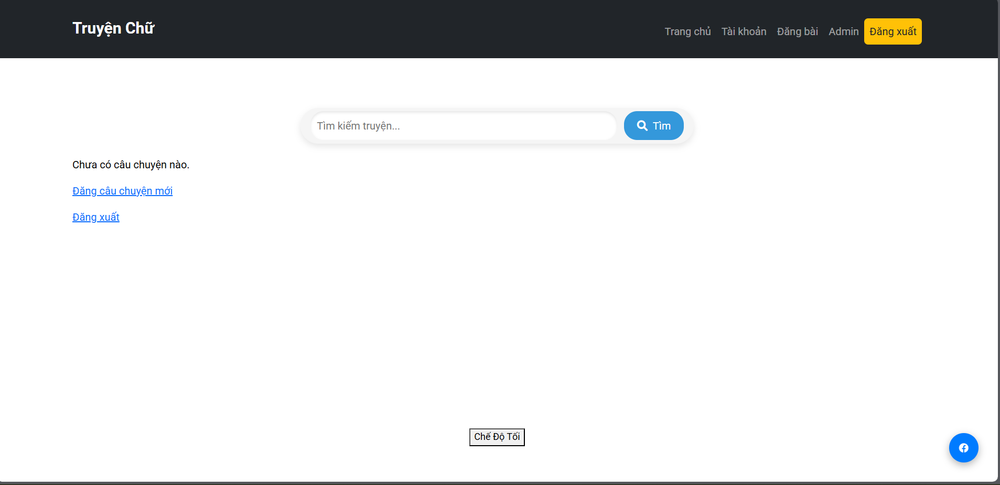
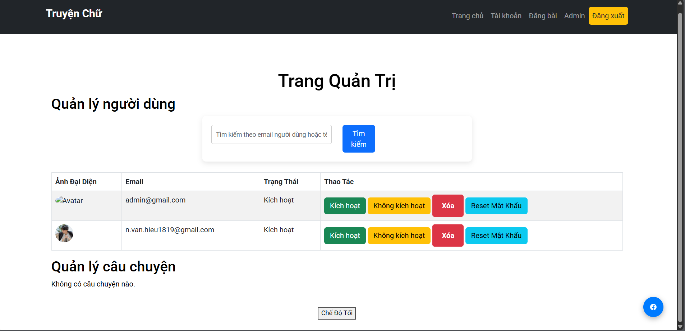

# 📚 Truyện Chữ - Ứng dụng đọc truyện trực tuyến bằng Flask

**🌐 Truy cập website tại: [https://truyenchu.onrender.com](https://truyenchu.onrender.com)**

Đây là một ứng dụng web đọc truyện chữ được xây dựng với **Flask**. Người dùng có thể đăng ký, đăng nhập (bằng tài khoản hoặc GitHub), tạo và quản lý truyện, đọc truyện, và phân quyền quản trị. Ứng dụng được triển khai trên Render.

---

## 🚫 Lưu ý khi đăng nhập GitHub

Do Render không lưu dữ liệu session/database nội bộ miễn phí, đăng nhập GitHub có thể gây lỗi và không lưu được dữ liệu người dùng.

---

## ⚙️ Tính năng nổi bật

- Đăng ký / đăng nhập người dùng thường
- Đăng nhập bằng GitHub (OAuth)
- Quản lý tài khoản cá nhân
- Quản trị (Admin) để kiểm duyệt người dùng & truyện
- Giao diện đơn giản, dễ sử dụng
- Đọc truyện trực tiếp từ trình duyệt

---

## 🗂️ Cấu trúc giao diện minh họa

### Đăng ký tài khoản

### Đăng nhập bằng tài khoản vừa tạo hoặc GitHub

### Giao diện trang chủ khi chưa đăng nhập

### Giao diện người dùng khi đã đăng nhập

### Giao diện trang chủ khi đã đăng nhập

### Giao diện quản trị admin

---

## 📦 Công nghệ sử dụng

- Python Flask
- Flask-Login, Flask-OAuth (GitHub login)
- SQLite 
- HTML/CSS (Jinja2 template)
- Triển khai trên Render.com

---

## 🤝 Đóng góp & phản hồi

Mọi ý kiến đóng góp, sửa lỗi và tính năng mới luôn được chào đón. Hãy mở issue hoặc pull request trên GitHub nếu bạn muốn đóng góp!

---

**Tác giả:** Nguyễn Văn Hiếu
